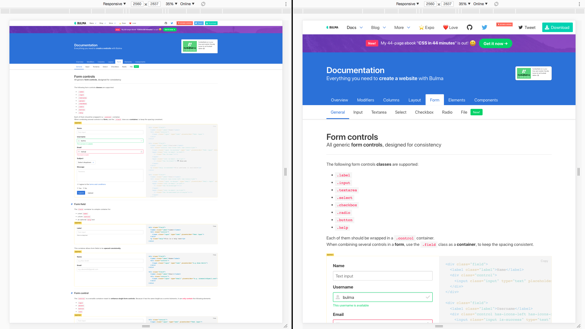

# Bulma Stylus

> Pure Stylus implementation of [Bulma.css](https://github.com/jgthms/bulma)

#### Notice! This package is used to integrate Bulma with Stylus, it does NOT includes builded css files.


## Install

_This package version is synchronous with Bulma, every difference between the same version of Bulma
will be logged in [Changelog](CHANGELOG.md)._

### NPM

```sh
npm install @shirohana/bulma-stylus
```

__or__

### Yarn

```sh
yarn add @shirohana/bulma-stylus
```

You can also install from GitHub for newest features which are not published yet until the expected
features was published. (`bulma-stylus` will bump new version only if `bulma` has already published
the same version)

```sh
yarn add git://github.com/shirohana/bulma.stylus.git#dev
```

## Links

- [📚 Offical documentation](https://bulma.io/documentation/overview/start)
- [📜 Changelog](CHANGELOG.md)

## Difference between Bulma

#### New Feature
- [\[1\]](#note1) Dynamic rem for better user experience on high-resolution screens
- [\[1\]](#note1) Support 4k container

[](https://raw.githubusercontent.com/shirohana/bulma.stylus/dev/docs/images/responsiveness-compare.png)

_Note: You can disable this feature by setting `$body-auto-scale = false` (default: `$fullhd`) before importing_

#### Internal
- [\[1\]](#note1) Use `em/rem` instead `px` in every elements and components
- Replace `lighten()` function with `sass-lighten()` which implements sass-like `lighten`
- Replace `darken()` function with `sass-darken()` which implements sass-like `darken`
- Remove `powerNumber()` function (Use Stylus [`exponent-operator`][stylus-operator-exponent] instead)
- Remove `colorLuminance()` function (Use Stylus built-in function [`luminosity()`][stylus-bifs-luminosity] instead)

<a id="note1" href="#note1">[1]</a>: _Not published yet_

[stylus-operator-exponent]: http://stylus-lang.com/docs/operators.html#exponent-
[stylus-bifs-luminosity]: http://stylus-lang.com/docs/bifs.html#luminositycolor

## Inherited copyright and license

© 2018 Jeremy Thomas. Code released under [the MIT license](https://github.com/jgthms/bulma/blob/master/LICENSE).
